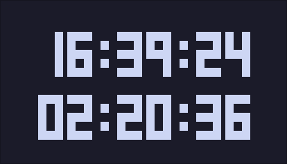

# TTY-Countdown II



A TTY countdown timer. Works on Python 3.8 or higher.


## Usage

```shell
usage: tty-countdown.py timetarget

Fancy countdown script

positional arguments:
  timetarget            Time target. Must be in HH:MM format.

options:
  -h, --help            show this help message and exit
```

