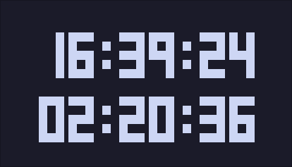

# TTY-Countdown II



A countdown timer that will live forever in the shadow of 
[tty-clock](https://github.com/xorg62/tty-clock).


## Usage

```shell
usage: tty-countdown.py [-h] [-f FONT] [-n] timetarget

Fancy countdown script

positional arguments:
  timetarget            Time target. Must be in HH:MM format.

options:
  -h, --help            show this help message and exit
  -f, --font FONT       Custom font file
  -n, --nocenter        Do not center timer (more efficient)
```

